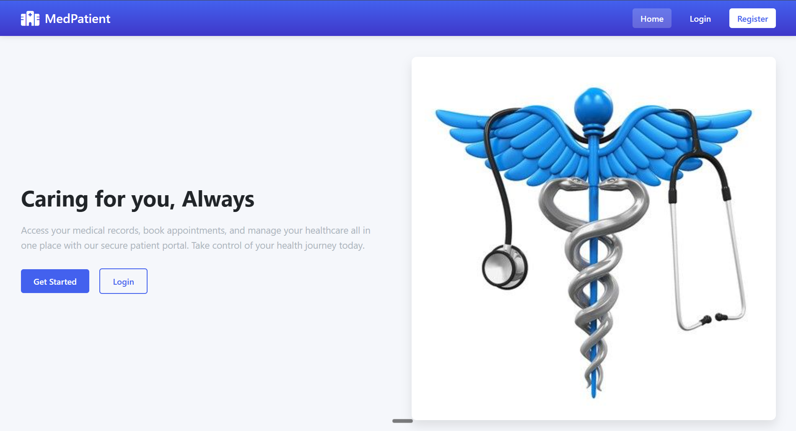
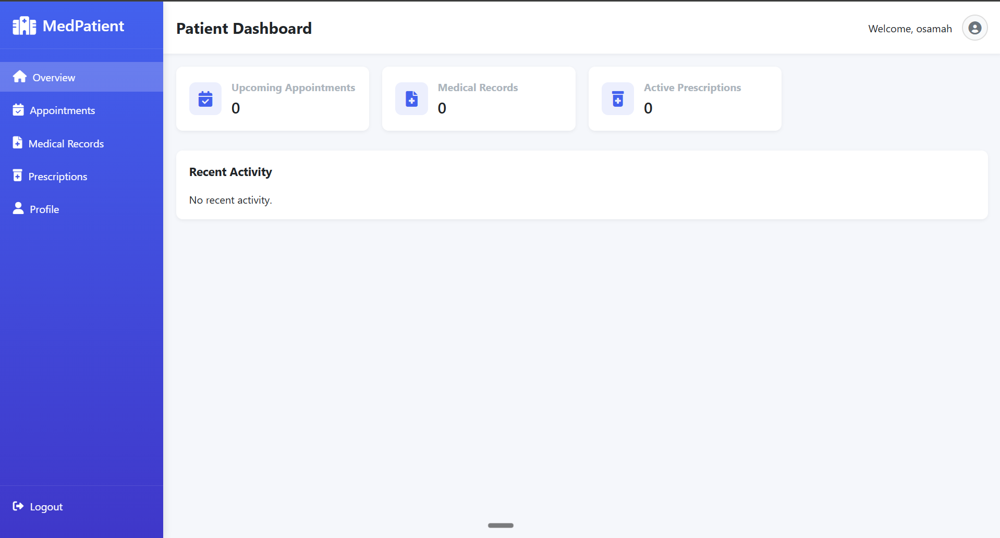
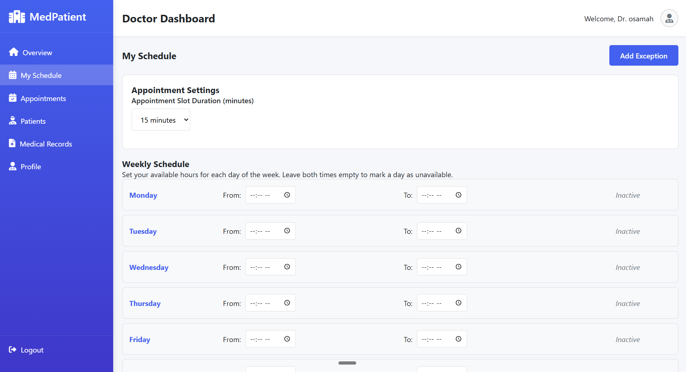

# 🏥 Unified Patient Healthcare Portal (HMS)

### 📘 Course Project: TSE6223-SOFTWARE ENGINE FUNDAMENTALS

[](https://php.net/)
[](https://mysql.com/)
[]()

## 🩺 Project Overview
The **Unified Patient Healthcare Portal** (Medical System) is a comprehensive web-based Hospital Management System. It aims to bridge the gap between medical practitioners and patients by providing a central interface for managing appointments, recording medical histories, and orchestrating hospital administration tasks effectively.

## 💉 Key Features
*   **Multi-Role Authentication:** Dedicated, secure dashboards for Administrators, Doctors, and Patients.
*   **Automated Appointment Scheduling:** Streamlined patient bookings integrated with doctor availability slots.
*   **Electronic Health Records (EHR):** Secure, retrievable tracking of patient medical histories and prescriptions.
*   **Dynamic Initialization:** Automatic database creation and table seeding on first launch.

## 🖥️ Tech Stack
*   **Backend:** PHP (Procedural/OOP architecture)
*   **Database:** MySQL
*   **Frontend:** HTML5, CSS3, JavaScript, Bootstrap

## 📷 Screenshots


*Figure 1: Main medical system landing and service overview.*


*Figure 2: Patient and appointment managerial interface.*


*Figure 3: Secure user authentication and system login.*

## 📂 Project Structure
```text
medical_system/
├── config/         # Database connection logic and auto-initialization (database.php)
├── public/         # Static assets, styles, and scripts
├── src/            # Core backend PHP processing logic 
└── assets/         # App screenshots
```

## ⚙️ Installation & Setup
1. Ensure you have a Web Server stack installed locally (e.g., XAMPP, WAMP, or LAMP).
2. Clone this repository into your server's `htdocs` or `www` directory.
3. Start the **Apache** and **MySQL** services from your control panel.

## 👨‍⚕️ How to Run
1. Access the application via `http://localhost/medical_system` (or run `php -S localhost:8080` if testing in a custom folder).
2. The application's `config/database.php` will **automatically** create the `medical_system` database and tables upon first connection.
3. Login using the default Admin credentials provided in the documentation to access the unified dashboard.
